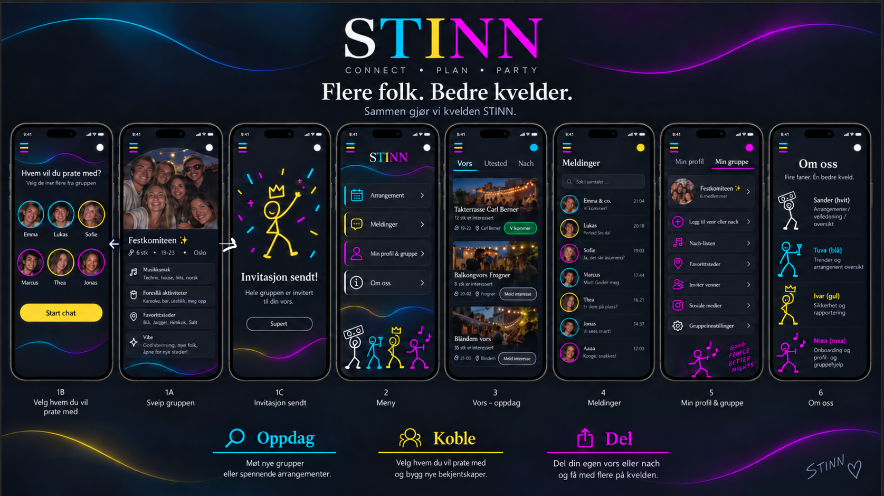

# Stinn, en sosial app
Dette prosjektet er et skikkelig vibe-design av en sosial app. Det finnes flere eksempler på app forsøk på en slags tinder for vennegrupper. Synes vi trengte en mer fargerik morsom app. Åpenbart er dette bare konsept i start-fase som jeg vurderer å kode. 

Illustrasjon her

## Om navnet: Stinn
Stinn kom rett fra ungdoms-slang Schtinn som gir appen et smooth navn å uttale.   
Fant kjapt ut at det kunne ha flere betydninger som passer fint til denne appen.   
"Her er det helt stinn" = Helt full stappet, som et utested.  
"Stinn av energi" = Fullt av energi   
"Stinn fest" = Sprengfull fest   

Det beskriver fint appens intensjon om å finne nye vennegrupper, invitere hele grupper til vors, fest, utesteder eller nach.   
Rett å slett for å lage en stinn fest.   

Eller så skal det bli mulig å velge ut spesifikke i en gruppe for å bli kjent over meldinger. 

Ønsker også å promotere enkelte utested og sette søkelys på hvor utrolig mye sosialt man kan delta i. 

## Rolle inndeling
Har forsøkt å dele inn roller i oppdiktede strekmenn fargefigurer for å få frem et slags Stinn team.  
S-ander - App manageren / vedlikeholderen (Hvit)  
T-uva - Skal styre med trender og arrengement oversikt (Blå)  
I-var - Fokus rundt trygge rammer online, og data sikkerhet. (Gul)  
N-ora - En slags assistent som senere skal innlede appen til nye brukere for å sette opp brukere. (Lilla) 

# Rød tråd
Fargene er alltid samme rekkefølge, og hver farge representerer en ting. Prikken oppe i høyre hjørne skal representere status / gi oversikt over hvor du befinner deg. 

# Flere brainstorm ideer
Stinn + (betalt abonnement)   
Snapchat hotkey i meldinger   
Arrangør kan legge til Features, f eks høytalere, lys, takterrase, dj osv.   
En leaderbord side for hver by   

# Eventuelle arbeids oppgaver
1 Utvkle en bedre hovedside  
2 Fikse alle kanter rundt de fargede "led bar"- i adobe og tegningene med photoshop for å få frem en mye mer clean look  
3 Kode alt  
4 Lage animasjoner for "art work" på last inn siden og lage animasjon marketing ad med de fire strek menn til en rå sang.  
5 Finne gode løsning på melding system og data sikkerhet   

# Min workflow 
Lage ideen i Figma. Jeg er ikke så god til å tegne men har klare ideer. Fin justere etterpå alt med ai eller adobe photoshop for å få et slags produkt. 
[Figma](./Bilder/08fullMap.png)

