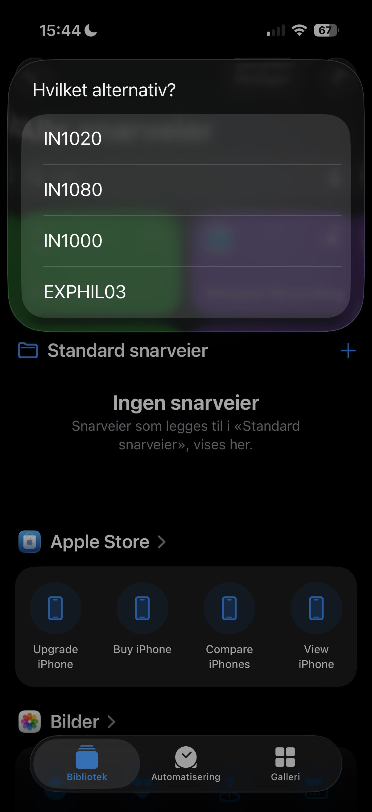
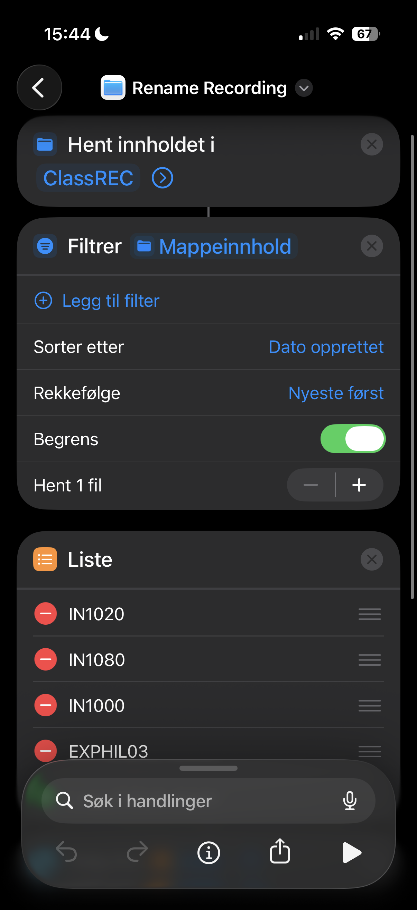
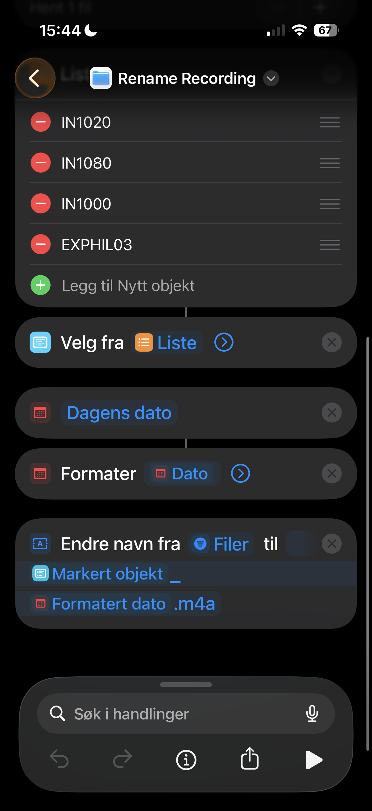
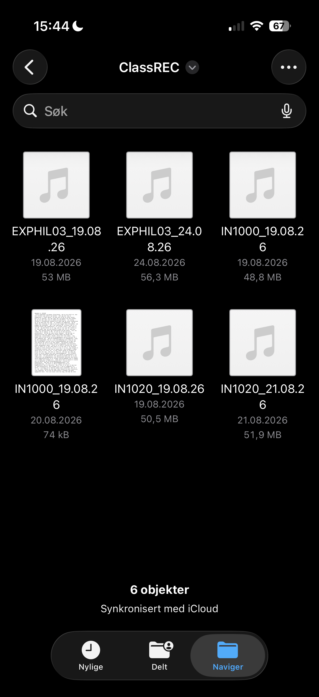

# Niche Notes 

En fremtidsrettet AI tool soon to be App. Hva om det var mulig å selv skrive notater i forelesningen og etter hver forelesning AUTOMAGISK få markert i dokumentet ting du misforsto og viktige ting foreleseren snakket om som du glemte helt å notere? Niche Notes kombinerer dine notater med det publiserte tale opptaket fra forelesningen slik at notatene dine strekker seg nærmere 100%. EN kombinasjon av AI transcript, note taker og en agent som jobber i dokumentet ditt. Hils på Niche Notes.

## Om navnet: Niche Notes
Ordet Niche har flere betydninger. Her refererer det til de spesifikke tingene (niche-tingene) som mangler i notatene dine – de viktige detaljene du glemte som AI-en finner fra forelesning opptakene. Det er også en helt unik måte å studere på og ligger langt unna mainstream—ens tilnærming til notater. Rett og slett Niche Notes.

## Detaljer
Foreløpig er dette kun et script hos meg. Har det travelt med deltidsjobb og universitet så har ikke utviklet det til noe andre kan bruke enda. Foreløpig liker jeg å ta voice memos på Apple Watch selv ovenfor å hente de fra nettsiden til UiO. Denne prossesen vurderer jeg automatisere med apple shortcuts slik at opptaket starter i samme sekund forelesningen gjør (tidspunkt hentet fra kalender appen). Nettsiden UiO tar ofte timer til dager før opptakene blir publisert. Her utfører jeg alt i 3 steg. Prøver å gjøre dette på student budsjett så full automatisert krever Claude subscription til 220kr i måneden. Er ikke det jeg er på utkikk etter. Ville ikke anbefalt å prøve dette scriptet i denne fasen men hvis du absolutt ønsker må du: endre fil navigeringen i scriptet og laste ned whisper lokalt. Jeg bruker base model for en realible gratis modell. Ja, det går treigere (cpu tid) og den i skyene utfører mye raskere transkripsjon fra opptak til txt. Det er helt klart løsningen jeg ville gått for hvis jeg utvikler dette til en app alle kan bruke. 

Tilbake til hvordan jeg gjør dette økonomisk. Apple shortcut bruker jeg for å navngi opptakene på en spesifikk måte slik at Claude klarer å forstå hva som hører til hvilket dokument. Hver gang jeg lagrer egne notat dokumenter lagrer jeg slik "Fagkode_dd.mm.yy". Eks EXPHIL03_28.08.26. Dermed blir opptaket navngitt identisk automatisk etter ett fingertrykk ved apple shortcut. Det ser slik ut.

Deretter runner jeg dette på terminal ett python script som jeg og Claude har utarbeidet. Transkripsjonen skjer via lokal Whisper base model (gratis, bare CPU-tid). Her kan man sette opp at den heller som jeg sa tidligere at det kjøres globalt for mer penger, fordel da bruker den veldig kort tid.  For analyse bruker jeg Claude API (~0.3kr per run). Her kjører jeg modell Haiku 4.5. Ikke den idelle men den er rask og billig.  

Sjekk det ut her: NB dette scriptet er ikke klart for egen bruk. 
[Python script](03nicheNotes/NicheNotes.py)

# Resultat? 
[In_action](Bilder/inAction01.png)
[In_action](Bilder/inAction02.png)

# Oppsumert i 3 enkle steg
Steg 1: Del opptak til filer (Apple icloud) 
Steg 2: Navngi opptak med ett apple shortcut trykk
Steg 3: Run script 

# Videre tanker og mål
Jeg studerer maskinlæring og kunstig intelligens. Jeg jobber enda med å legge inn begrensinger for hva jeg anser som nødvendig og unødvendig i Niche notes. Etterhvert som ekspertisen min blir bedre håper jeg på å utvikle dette til en app. Tilgjengelig for alle studenter. Appen kan forstatt bruke samme api. Men derimot ønsker jeg at AI selv gjenkjenner faget basert på de første 5-10min av forelseningen. Hvert universitet bruker fagkoder som gjør at den kan skjønne hvilket fag studenten er i. Hente opptaket selv og ordne alle notatene dine til en bedre versjon uten at du gjør noe som helst annet enn å trykke "Niche it" i appen. En annen ting jeg ønsker å få til er at imens kunstig intellgiens markerer feil at den registrer den personlige måten du tar notater på og etterligner deretter når den legger til notatene dine. 

# Min farge palett
Rød: 
#DC2626
Lilla: 
#8B5CF6
Sølv: 
#9CA3AF

# Debugging fra tidligere versjoner 
V1 - Problem med å skille ut personlig snakk fra foreleser. Løsningen ble for ai å se på fagrelevant stoff i txt. 
V2 - Det var en bug med å hente nyeste opptak. Den ordnet claude på 25s. 
V3 - Denne versjonen brukte evigheter på transcript. Løsning - bytte til base model. 
V4 - Nåværende versjon, endret tilatelser og begrensninger. 